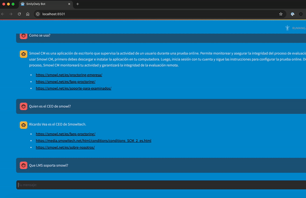
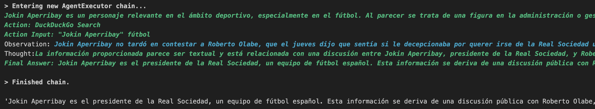

# Chatbot POCs with LangChain and Open-Source Models

This repository contains code for building proof-of-concept (POC) chatbots using Python and LangChain. It explores various techniques such as Retrieval Augmented Generation (RAG), agents and tools. All code in this repository utilizes open-source models, ensuring a flexible and accessible approach to chatbot development.


## Requirements

To run the code, you'll need Python 3.8 or higher.

1. Clone the repository:
   ```bash
   git clone https://github.com/IGRDA/chatbots.git
   cd your-repo-name
   ```

2. Install the required dependencies:
    ```bash
    pip install -r requirements.txt
   ```

3. Download Ollama and pull the Llama 3.1 model:
- First, install Ollama from [Ollama's official website](https://ollama.com/).
- Then, run the following command to pull the Llama 3.1 model:
  ```
  ollama pull llama3.1:8b
  ollama pull qwen:32b
  ```

## Chatbot Examples

### Run SmilyOwl chatbot:
   ```
   cd smowltech-chatbotstreamlit/
   streamlit run app.py
   ```


### Agents and tools:
Run the notebook in:
   ```
   cd /Users/inaki.gorostiaga/Personal/chatbots/agents-tools/notebooks
   ```


## Notes

The code utilizes open-source LLMs that can be run locally. It uses *lama3.1:8b* for RAG and *qwen:32b* for agents, as agents require more powerful models. These models can easily be swapped with proprietary models, significantly improving both the accuracy and quality of the results. For becnhmarking see for example https://artificialanalysis.ai/leaderboards/models.


## License

This project is licensed under the Apache 2.0 License - see the [LICENSE](LICENSE) file for details.
